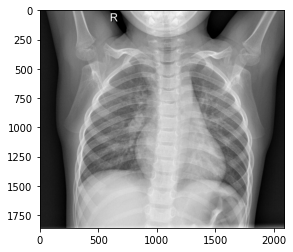
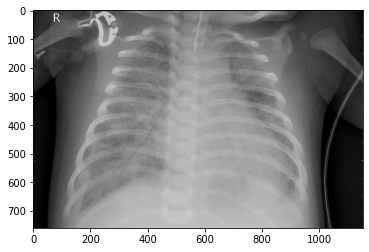
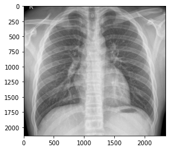
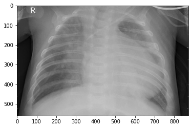

```python
import numpy as np
import pandas as pd
import matplotlib.pyplot as plt
import seaborn as sns
%matplotlib inline
import os
```


```python
from matplotlib.image import imread
```


```python
pwd
```


    'C:\\Users\\HP\\Desktop\\Kaggle_Challenges\\Chest_XRay\\chest_xray'


```python
my_data_dir = 'C:\\Users\\HP\\Desktop\\Kaggle_Challenges\\Chest_XRay\\chest_xray\\chest_xray\\'
```


```python
os.listdir(my_data_dir)
```


    ['test', 'train', 'val']


```python
train_path = my_data_dir + "train"
test_path = my_data_dir + "test"
val_path = my_data_dir + "val"
```


```python
os.listdir(train_path)
```


    ['NORMAL', 'PNEUMONIA']


```python
os.listdir(test_path)
```


    ['NORMAL', 'PNEUMONIA']


```python
os.listdir(val_path)
```


    ['NORMAL', 'PNEUMONIA']


```python
os.listdir(train_path+"\\NORMAL")[0]
```


    'IM-0115-0001.jpeg'


```python
norm_1 = imread(train_path+"\\NORMAL"+"\\IM-0115-0001.jpeg")
```


```python
plt.imshow(norm_1,cmap='gray')
```


    <matplotlib.image.AxesImage at 0x19832effe50>


    

    


```python
os.listdir(train_path+"\\PNEUMONIA")[0]
```


    'person1000_bacteria_2931.jpeg'


```python
pne_1 = imread(train_path+"\\PNEUMONIA"+'\\person1000_bacteria_2931.jpeg')
```


```python
plt.imshow(pne_1,cmap='gray')
```


    <matplotlib.image.AxesImage at 0x198330bdc10>


    

    


```python
norm_1.shape
```


    (1858, 2090)


```python
pne_1.shape
```


    (760, 1152)


```python
type(pne_1)
```


    numpy.ndarray


```python
img_shape = (150,150,3)
```


```python
from tensorflow.keras.preprocessing.image import ImageDataGenerator
```


```python
image_gen = ImageDataGenerator(rotation_range=20, width_shift_range=0.10, height_shift_range=0.10, 
                               rescale=1/255, shear_range=0.1, zoom_range=0.1, horizontal_flip=True, fill_mode='nearest' )
```


```python
from tensorflow.keras.models import Sequential
from tensorflow.keras.layers import Activation, Dropout, Flatten, Dense, Conv2D, MaxPooling2D
```


```python
model = Sequential()

model.add(Conv2D(filters=64, kernel_size=(3,3),input_shape=img_shape, activation='relu'))
model.add(MaxPooling2D(pool_size=(2, 2)))

model.add(Conv2D(filters=64, kernel_size=(3,3),input_shape=img_shape, activation='relu'))
model.add(MaxPooling2D(pool_size=(2, 2)))

model.add(Conv2D(filters=64, kernel_size=(3,3),input_shape=img_shape, activation='relu'))
model.add(MaxPooling2D(pool_size=(2, 2)))

model.add(Flatten())

model.add(Dense(128,activation='relu'))

model.add(Dropout(0.5))

model.add(Dense(1,activation='sigmoid'))

model.compile(loss='binary_crossentropy',optimizer='adam',metrics=['accuracy'])
```


```python
model.summary()
```

    Model: "sequential_1"
    _________________________________________________________________
    Layer (type)                 Output Shape              Param #   
    =================================================================
    conv2d_3 (Conv2D)            (None, 148, 148, 64)      1792      
    _________________________________________________________________
    max_pooling2d_3 (MaxPooling2 (None, 74, 74, 64)        0         
    _________________________________________________________________
    conv2d_4 (Conv2D)            (None, 72, 72, 64)        36928     
    _________________________________________________________________
    max_pooling2d_4 (MaxPooling2 (None, 36, 36, 64)        0         
    _________________________________________________________________
    conv2d_5 (Conv2D)            (None, 34, 34, 64)        36928     
    _________________________________________________________________
    max_pooling2d_5 (MaxPooling2 (None, 17, 17, 64)        0         
    _________________________________________________________________
    flatten_1 (Flatten)          (None, 18496)             0         
    _________________________________________________________________
    dense_1 (Dense)              (None, 128)               2367616   
    _________________________________________________________________
    dropout (Dropout)            (None, 128)               0         
    _________________________________________________________________
    dense_2 (Dense)              (None, 1)                 129       
    =================================================================
    Total params: 2,443,393
    Trainable params: 2,443,393
    Non-trainable params: 0
    _________________________________________________________________
    


```python
from tensorflow.keras.callbacks import EarlyStopping
early_stop = EarlyStopping(monitor='val_loss',patience=2,restore_best_weights=True)
```


```python
batch_size = 16
```


```python
train_image_gen = image_gen.flow_from_directory(train_path,target_size=img_shape[:2],color_mode='rgb', batch_size=batch_size,
                                               class_mode='binary', shuffle=True)
```

    Found 5216 images belonging to 2 classes.
    


```python
val_image_gen = image_gen.flow_from_directory(val_path,target_size=img_shape[:2],color_mode='rgb',batch_size=batch_size,
                                               class_mode='binary',shuffle=False)
```

    Found 16 images belonging to 2 classes.
    


```python
test_image_gen = image_gen.flow_from_directory(test_path,target_size=img_shape[:2],batch_size=batch_size,
                                               class_mode='binary',shuffle=False)
```

    Found 624 images belonging to 2 classes.
    


```python
train_image_gen.class_indices
```


    {'NORMAL': 0, 'PNEUMONIA': 1}


```python
results = model.fit_generator(train_image_gen,epochs=10, validation_data=val_image_gen,callbacks=[early_stop])
```

    C:\Users\HP\anaconda3\lib\site-packages\tensorflow\python\keras\engine\training.py:1940: UserWarning: `Model.fit_generator` is deprecated and will be removed in a future version. Please use `Model.fit`, which supports generators.
      warnings.warn('`Model.fit_generator` is deprecated and '
    

    Epoch 1/10
    326/326 [==============================] - 219s 670ms/step - loss: 0.4142 - accuracy: 0.8196 - val_loss: 1.0482 - val_accuracy: 0.7500
    Epoch 2/10
    326/326 [==============================] - 220s 675ms/step - loss: 0.2923 - accuracy: 0.8727 - val_loss: 1.4154 - val_accuracy: 0.6250
    Epoch 3/10
    326/326 [==============================] - 231s 709ms/step - loss: 0.2291 - accuracy: 0.9009 - val_loss: 1.4887 - val_accuracy: 0.7500
    


```python
model.save('cxr_model_2.h5')
```


```python
model_df = pd.DataFrame(model.history.history)
```


```python
model_df
```


<div>
<style scoped>
    .dataframe tbody tr th:only-of-type {
        vertical-align: middle;
    }

    .dataframe tbody tr th {
        vertical-align: top;
    }

    .dataframe thead th {
        text-align: right;
    }
</style>
<table border="1" class="dataframe">
  <thead>
    <tr style="text-align: right;">
      <th></th>
      <th>loss</th>
      <th>accuracy</th>
      <th>val_loss</th>
      <th>val_accuracy</th>
    </tr>
  </thead>
  <tbody>
    <tr>
      <th>0</th>
      <td>0.414183</td>
      <td>0.819594</td>
      <td>1.048191</td>
      <td>0.750</td>
    </tr>
    <tr>
      <th>1</th>
      <td>0.292295</td>
      <td>0.872699</td>
      <td>1.415353</td>
      <td>0.625</td>
    </tr>
    <tr>
      <th>2</th>
      <td>0.229100</td>
      <td>0.900882</td>
      <td>1.488686</td>
      <td>0.750</td>
    </tr>
  </tbody>
</table>
</div>


```python
cnn_pred = model.predict_generator(test_image_gen)
```

    C:\Users\HP\anaconda3\lib\site-packages\tensorflow\python\keras\engine\training.py:2001: UserWarning: `Model.predict_generator` is deprecated and will be removed in a future version. Please use `Model.predict`, which supports generators.
      warnings.warn('`Model.predict_generator` is deprecated and '
    


```python
#cnn_pred
```


```python
predictions = cnn_pred > 0.5 
```


```python
from sklearn.metrics import confusion_matrix,classification_report, accuracy_score
```


```python
print(classification_report(test_image_gen.classes , predictions))
```

                  precision    recall  f1-score   support
    
               0       0.84      0.51      0.63       234
               1       0.76      0.94      0.84       390
    
        accuracy                           0.78       624
       macro avg       0.80      0.72      0.74       624
    weighted avg       0.79      0.78      0.76       624
    
    


```python
print(confusion_matrix(test_image_gen.classes,predictions))
```

    [[119 115]
     [ 23 367]]
    


```python
x = np.arange(0,1,0.01)
```


```python
d = []
for i in x:
    prediction = cnn_pred > i
    d.append(accuracy_score(test_image_gen.classes,prediction))
```


```python
the_df = pd.DataFrame({'threshold':list(x) , 'accuracy': d})
```


```python
the_df[the_df['accuracy']==the_df['accuracy'].max()]
```


<div>
<style scoped>
    .dataframe tbody tr th:only-of-type {
        vertical-align: middle;
    }

    .dataframe tbody tr th {
        vertical-align: top;
    }

    .dataframe thead th {
        text-align: right;
    }
</style>
<table border="1" class="dataframe">
  <thead>
    <tr style="text-align: right;">
      <th></th>
      <th>threshold</th>
      <th>accuracy</th>
    </tr>
  </thead>
  <tbody>
    <tr>
      <th>64</th>
      <td>0.64</td>
      <td>0.804487</td>
    </tr>
    <tr>
      <th>65</th>
      <td>0.65</td>
      <td>0.804487</td>
    </tr>
  </tbody>
</table>
</div>


# hence the threshold should be 0.64


```python
threshold = 0.64
```


```python
prediction = cnn_pred > threshold
```


```python
print(confusion_matrix(test_image_gen.classes,predictions))
print('\n')
print(classification_report(test_image_gen.classes,predictions))
```

    [[119 115]
     [ 23 367]]
    
    
                  precision    recall  f1-score   support
    
               0       0.84      0.51      0.63       234
               1       0.76      0.94      0.84       390
    
        accuracy                           0.78       624
       macro avg       0.80      0.72      0.74       624
    weighted avg       0.79      0.78      0.76       624
    
    

# prediction on a single image


```python
from tensorflow.keras.preprocessing import image
```

# NORMAL CHEST XRAY


```python
sample_image_1 = imread(test_path + "\\NORMAL\\"+"IM-0029-0001.jpeg" ) 
```


```python
plt.imshow(imread(test_path + "\\NORMAL\\"+"IM-0029-0001.jpeg"),cmap='gray')
```


    <matplotlib.image.AxesImage at 0x1983e9dd250>


    

    


```python
sample_image_1 = image.load_img(test_path + "\\NORMAL\\"+"IM-0029-0001.jpeg",target_size=(150,150))
sample_image_1 = image.img_to_array(sample_image_1)
sample_image_1 = np.expand_dims(sample_image_1,axis=0)
sample_image_1 = sample_image_1/255
```


```python
prediction_prob = model.predict(sample_image_1)
```


```python
# function to implement whether the predictied probabilty is close to NORMAL or PNEUMONIA
def cxr(x):
    if x >= threshold:
        return('PNEUMONIA')
    else:
        return ('NORMAL')
```


```python
print(cxr(prediction_prob))
```

    NORMAL
    

# CORRECT PREDICTION

# NOW LET'S CHECK FOR PNEUMONIA CHEST XRAY


```python
sample_image_2 = image.load_img(test_path + "\\PNEUMONIA\\"+"person1_virus_11.jpeg",target_size=(150,150))
sample_image_2 = image.img_to_array(sample_image_2)
sample_image_2 = np.expand_dims(sample_image_2,axis=0)
sample_image_2 = sample_image_2/255
```


```python
plt.imshow(imread(test_path + "\\PNEUMONIA\\"+"person1_virus_11.jpeg"),cmap='gray')
```


    <matplotlib.image.AxesImage at 0x1983ea27eb0>


    

    


```python
pred = model.predict(sample_image_2)
```


```python
print(cxr(pred))
```

    PNEUMONIA
    

# OUR MODEL PREDCICTED CORRECTLY


```python

```
